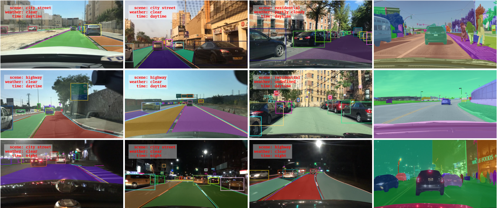

# BDD100K Autonomous Vehicle Data Pipeline

End-to-end ELT pipeline simulating a real-world labeling workflow for autonomous vehicle perception models. Built on the [BDD100K](https://www.vis.xyz/bdd100k/) dashcam dataset from UC Berkeley — 70K driving clips with detection, segmentation, and scene attribute labels.

I currently work as a data labeler at Tesla, where I annotate ground-truth data that feeds Autopilot's training pipelines. The work made me genuinely curious about what happens to the data *after* it leaves my queue — how labeled clips get validated, transformed, cataloged, and surfaced as training and evaluation data. This project is my attempt to build that side of the pipeline myself, end-to-end. It covers only one slice (labeled clip metadata, not the raw video — yet), but it's been a great way to learn how the work I see every day fits into a larger system.

The project is designed around the questions a labeling ops team actually asks: *Where are our coverage gaps? Which conditions are over- or under-represented? How densely is each clip annotated?*

---

## What the Data Looks Like

Each BDD100K clip is a single dashcam frame paired with a JSON file containing object detections, segmentation polygons, and clip-level scene attributes (weather, time of day, scene type).



*Example BDD100K frames with labeled bounding boxes and segmentation polygons. Source: [BDD100K](https://www.vis.xyz/bdd100k/).*

Here's an abridged version of what the raw JSON looks like — one object detection (a car), one lane line, and one drivable area:

```json
{
    "name": "cabc30fc-e7726578",
    "attributes": {
        "weather": "clear",
        "scene": "city street",
        "timeofday": "dawn/dusk"
    },
    "frames": [
        {
            "timestamp": 10000,
            "objects": [
                {
                    "category": "car",
                    "id": 6,
                    "attributes": {
                        "occluded": false,
                        "truncated": false,
                        "trafficLightColor": "none"
                    },
                    "box2d": {
                        "x1": 654.6,
                        "y1": 414.1,
                        "x2": 734.8,
                        "y2": 487.6
                    }
                },
                {
                    "category": "lane/single white",
                    "id": 14,
                    "attributes": {
                        "direction": "parallel",
                        "style": "dashed"
                    },
                    "poly2d": [
                        [399.9, 653.0, "L"],
                        [651.5, 464.3, "L"]
                    ]
                },
                {
                    "category": "area/drivable",
                    "id": 9,
                    "attributes": {},
                    "poly2d": [
                        [633.4, 489.7, "L"],
                        [434.3, 646.6, "L"],
                        [511.3, 644.6, "C"],
                        [955.7, 643.3, "L"],
                        [778.5, 489.7, "L"],
                        [633.4, 489.7, "L"]
                    ]
                }
            ]
        }
    ]
}
```

Each clip contains many such labels — typically 10–40 objects plus 5–15 segmentations per frame. The pipeline ingests 70K of these JSON files, flattens them into normalized parquet datasets (one row per object, one per segmentation, one per clip), and exposes them through Athena and dbt for downstream analytics.

---

## Architecture

```
BDD100K JSONs (local)
        │
        ▼   async upload via aioboto3
   S3: raw/labels/                              ← 70K JSON files
        │
        ▼   Polars-based async extraction
   S3: processed/                               ← clips, objects, segmentations parquet
        │
        ▼   Pydantic v2 schema validation
   S3: validated/clean/    +    quarantine/     ← contract-enforced data
        │
        ▼   AWS Glue Crawler
   Glue Catalog → Athena (SQL access)
        │
        ▼   dbt-athena (staging views + mart tables)
   bdd100k_dbt schema:
     ├── stg_clips, stg_objects, stg_segmentations
     ├── fct_clip_summary (per-clip metrics)
     └── fct_dataset_distribution (coverage analysis)
        │
        ▼   queries via pyathena
   Streamlit dashboard (in progress)
```
---

## Stack

| Layer | Tools |
|---|---|
| **Language** | Python 3.12, SQL |
| **Ingestion / Extraction** | aioboto3, asyncio, Polars |
| **Validation** | Pydantic v2 |
| **Storage** | AWS S3 (parquet) |
| **Catalog & Query** | AWS Glue, AWS Athena |
| **Transformation** | dbt-athena, dbt-utils |
| **Dashboard** *(planned)* | Streamlit |
| **Orchestration** *(planned)* | Apache Airflow |
| **Containerization** *(planned)* | Docker, Docker Compose |
| **Package Management** | uv |

---

## Current State

### ✅ Complete

- **Async ingestion** of 70K JSON label files to S3 using `aioboto3` with semaphore-controlled concurrency
- **Extraction** of nested JSON into 3 normalized parquet datasets (clips, objects, segmentations) using Polars
- **Schema validation** with Pydantic v2, including thoughtful design separating validation (structural correctness) from transformation (normalization), with malformed rows routed to a quarantine partition
- **AWS infrastructure** scripted via boto3: Glue database, crawler with polling-based completion handling, Athena workgroup — all idempotent and rerunnable
- **dbt project** with 5 models across staging (views) and marts (persisted tables in S3 + Glue):
  - `stg_clips`, `stg_objects` (with bike→bicycle / motor→motorcycle normalization), `stg_segmentations`
  - `fct_clip_summary`: per-clip aggregations with object counts by category and segmentation counts by type
  - `fct_dataset_distribution`: coverage analysis across (weather, time-of-day, scene type) combinations
- **54 automated dbt tests** covering not-null constraints, uniqueness, foreign key relationships, accepted categorical values, and combination uniqueness — all passing
- **Comprehensive YAML documentation** for every model and column
- **Streamlit dashboard** querying the dbt marts via Athena — coverage analysis views, per-clip exploration, filtering by environmental attributes

### 🚧 In Progress

- **Docker Compose** stack containerizing the pipeline for local reproducibility

### 📋 Planned

- **ML preprocessing extension**: rasterize segmentation polygons into per-pixel masks for downstream semantic segmentation training

---

## Key Design Decisions

A few decisions worth calling out, because they reflect real architectural thinking:

**Validation rejects only structurally invalid data.** Originally, raw category values like `bike` and `motor` and clip-level `undefined` weather/time-of-day labels were all quarantined as "invalid." I refactored this: validators now reject only structurally malformed rows. Valid-but-inconsistent values (`bike` vs `bicycle`) flow through to the staging layer where dbt normalizes them. `undefined` is preserved as a meaningful labeler-assigned value (representing "couldn't determine"), not silently dropped. This restored ~18K rows that were being incorrectly quarantined and aligned the pipeline with a clean validation/transformation separation.

**Materialization strategy.** Staging models are views (lightweight, recomputed per query); mart models are persisted tables (parquet in S3, fast for dashboard queries). Trade-off rationale: staging is cheap and changes often during development, marts are queried frequently and benefit from precomputation.

**`total_cyclists` definition.** BDD100K labels riders and bicycles separately for the same physical scene. To avoid double-counting a single cyclist as two objects, `total_cyclists` counts only the `rider` category. The bike itself is captured separately in `total_objects`.

**`total_pedestrian_infrastructure`.** Combines crosswalks and curbs into a single semantic category, framed around the labeling-pipeline question: "Where could pedestrians plausibly appear?" This is more actionable than a generic "other segmentations" bucket.

**LEFT JOIN preservation.** `fct_clip_summary` LEFT JOINs aggregations to `stg_clips`, ensuring clips with zero objects or zero segmentations are still represented (with COALESCE'd zeros). Silent row drops are a common pipeline bug; this design prevents them.

---

## Repository Structure

```
bdd100k-data-pipeline/
├── src/
│   ├── ingest.py                   # Local JSONs → S3 (one-time bootstrap)
│   ├── extract.py                  # JSONs → normalized parquet
│   ├── models/                     # Pydantic schemas for clips, objects, segmentations
│   ├── validate/                   # Per-entity validators with clean/quarantine routing
│   └── utils/                      # S3 helpers, validation utilities
├── infra/
│   ├── setup_glue.py               # Idempotent Glue database + crawler setup with completion polling
│   └── setup_athena.py             # Athena workgroup setup
├── dbt/bdd100k/
│   ├── dbt_project.yml
│   ├── packages.yml                # dbt-utils dependency
│   └── models/
│       ├── staging/                # stg_clips, stg_objects, stg_segmentations + sources YAML + models YAML
│       └── marts/                  # fct_clip_summary, fct_dataset_distribution
├── pyproject.toml
└── uv.lock
```
---

## Setup

```bash
# Clone
git clone https://github.com/mateor02/bdd100k-data-pipeline.git
cd bdd100k-data-pipeline

# Install dependencies (uv handles env + lockfile)
uv sync

# Configure AWS credentials and bucket name in .env (see .env.example)
# Then run pipeline steps:
PYTHONPATH=src uv run python src/validate/clip_validator.py
PYTHONPATH=src uv run python src/validate/object_validator.py
PYTHONPATH=src uv run python src/validate/segmentation_validator.py
uv run python infra/setup_glue.py
uv run python infra/setup_athena.py

# Run dbt models and tests
uv run dbt deps --project-dir dbt/bdd100k
uv run dbt run --project-dir dbt/bdd100k
uv run dbt test --project-dir dbt/bdd100k
```

---

## What This Project Demonstrates

This project is built around the kinds of decisions a real data engineering team makes — not just the mechanics of moving data around. Specifically:

- Designing pipelines with clear separation between ingestion, validation, transformation, and serving
- Treating validation as a contract (reject malformed) and transformation as shaping (normalize, derive) — two distinct layers with two distinct jobs
- Making thoughtful architectural choices that preserve data quality without erasing meaningful labeler-assigned values like `undefined`
- Writing tests that mirror the architecture and catch real regressions
- Modeling fact tables around the questions consumers will ask, not for hypothetical completeness
- Choosing tools for their fit (Polars for high-throughput Python, dbt for analytical SQL, Athena for serverless query against a data lake)

---

## Dataset

[BDD100K](https://www.vis.xyz/bdd100k/) by UC Berkeley DeepDrive. 100K driving video clips with object detection bounding boxes, semantic segmentation polygons, and scene attributes (weather, time-of-day, scene type). This project uses the 70K labeled subset.
